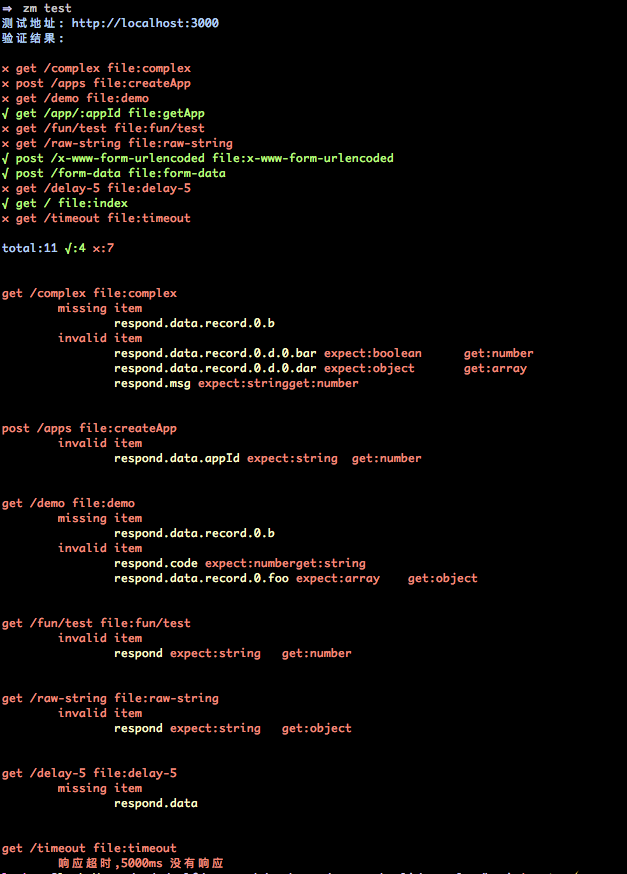

该示例说明如何在真实项目中使用 zen-mock-cli

在基于接口开发的前后端项目中,开发流程一般如下

1. 参照接口文档前端 mock 数据完成界面逻辑
2. 后端完成接口后,前端配置代理验证接口
3. 完成前后联调

采用 zen-mock 工具可以很好的完成第 1 各阶段任务.

但是在后续阶段,若后端并未编写接口测试,返回可能和文档规定不符.
此时前端需手动测试接口,验证功能的正常性.

> 当然前端也可以使用 postman 等工具实现自动测试后端接口.

为了尽肯能简化联调工作,我们可以直接利用 mock 数据作为期望输出,
此时只需简单在 mock 目录配置请求内容.及期望测试的服务端地址,利用 zen-mock-cli 即可验证服务端接口是否符合预期.

对于常规的字段校验,包含如下两部分

* 完整性验证,校验是否有字段缺失和冗余
* 合法性验证,校验字段是否符合类型规则
  
zen-mock 目前会查找缺失字段和对按照 json 类型进行简单比对.

> 由于缺失和错误类型字段会影响到前端界面层,而冗余字段对客户端而言并无太大影响,所以并未输出

基于上述的使用场景,参看范例目录结构.

```
├── .zenmock.js //命令行配置文件
├── README.md //范例说明文件
├── mock //前端 mock 文件夹
├── package.json
└── remote //模拟服务端请求
```

查看 [.zenmock.js](./.zenmock.js),root 配置 mock 根目录,
testUrl 配置需要验证的服务端地址.此处利用 remote 模拟后端完成的接口请求.
运行如下脚本.

```bash
# 安装依赖
npm install
# 启动模拟的后端
npm run remote
# 运行测试
npm run mock:test
```




该输出即是利用 mock 作为期望输出和服务端实际输出进行对比.
可以直观的看出服务端有 7 个接口的输出不符合 mock 期望.
后续详细说明了各出错接口的原因.

* `missing item` 表示缺失字段
* `ivalid item` 表示不符合期望类型的字段

    > 此处我们只提供了简单的 json 类型匹配,复杂类型校验会增加额外的配置复杂性,目前暂不考虑
* 一个接口响应超时,可使用 `timeout` 选项设定超时时间
详细的配置执行 `zm --help` 或运行子命令 `--help` 查看.

> 所有命令配置项均可在项目根目录的 `.zenmock.js` 文件中写入.避免在命令中进行传入.


